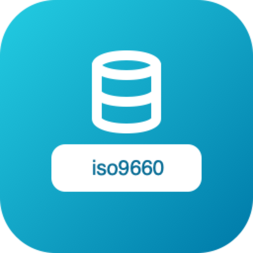
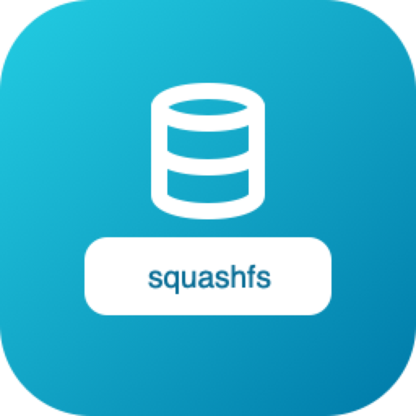
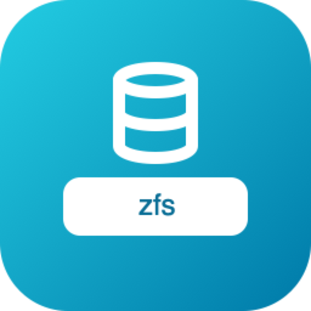

# Drivers

The 12 filesystem drivers available today. **Read** = open & inspect · **Write** = mutate in place · **Format** = create a fresh image.

| | Module | Read | Write | Format | Label | Symlinks | On-disk format |
|---|---|:--:|:--:|:--:|:--:|:--:|---|
|  | [`apfs`](apfs.md) | ✅ | ✅ | ✅ | — | ✅ | Real APFS on-disk (kext-mountable), GPT-aware |
|  | [`btrfs`](btrfs.md) | ✅ | ✅ | ✅ | ✅ | ✅ | Single-device, CRC32c (btrfs-progs ≥ 5.x) |
|  | [`exfat`](exfat.md) | ✅ | ✅ | ✅ | ✅ | ✕ | exFAT |
|  | [`ext4`](ext4.md) | ✅ | ✅ | ✅ | ✅ | ✅ | ext4 — extents, 64-bit, flex_bg, dir htree, metadata_csum (CRC32c) |
|  | [`fat32`](fat32.md) | ✅ | ✅ | ✅ | ✅ | ✕ | FAT32 |
|  | [`iso9660`](iso9660.md) | ✅ | ✕ | ✕ | — | ✅ | ISO 9660 / ECMA-119 + Rock Ridge (names/perms/symlinks) + Joliet (UCS-2 names) |
|  | [`ntfs`](ntfs.md) | ✅ | ✅ | ✅ | ✅ | ✕ | Minimal in-image blob model — NOT the real NTFS on-disk format |
|  | [`squashfs`](squashfs.md) | ✅ | ✕ | ✕ | — | ✅ | SquashFS 4.0 read-only archive; gzip/xz/zstd/lzo blocks + fragments |
|  | [`uefi`](uefi.md) | ✅ | ✅ | ✅ | — | — | OVMF/EDK2 NvVar variable store; time-based authenticated writes |
|  | [`ufs`](ufs.md) | ✅ | ✅ | ✅ | — | ✅ | UFS2 (FreeBSD 14.x) read+write; UFS1 read |
|  | [`xfs`](xfs.md) | ✅ | ✅ | ✅ | ✅ | ✅ | XFS v5 (CRC32c, ftype) |
|  | [`zfs`](zfs.md) | ✅ | ✅ | ✅ | — | — | Single pool / single vdev (test-oriented subset) |
