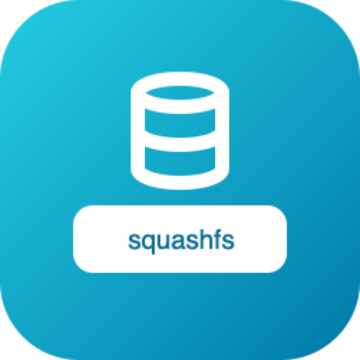
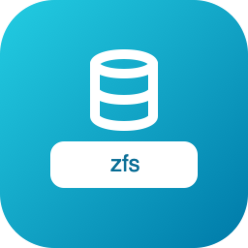

# Drivers

The 15 filesystem drivers available today (plus `oci`, a read-only
image-as-filesystem overlay, and `detect`, a type-probing dispatch registry —
both listed separately below since neither targets an on-disk *format* in the
same sense as the rows in this table).

| | Module | Read | Write | Format | Label | Symlinks | Quota | Snapshots | Encryption | On-disk format | Platform |
|---|---|:--:|:--:|:--:|:--:|:--:|:--:|:--:|:--:|---|---|
|  | [`apfs`](apfs.md) | ✅ | ✅ | ✅ | — | ✅ | — | ✅ | ✅ | Real APFS on-disk (kext-mountable), GPT-aware | macOS / iOS |
|  | [`btrfs`](btrfs.md) | ✅ | ✅ | ✅ | ✅ | ✅ | ✕ | ✕ | — | Single-device, CRC32c (btrfs-progs ≥ 5.x) | Linux |
|  | [`exfat`](exfat.md) | ✅ | ✅ | ✅ | ✅ | ✕ | — | — | — | exFAT | Windows / removable |
|  | [`ext4`](ext4.md) | ✅ | ✅ | ✅ | ✅ | ✅ | ✕ | — | ✕ | ext4 — extents, 64-bit, flex_bg, dir htree, metadata_csum (CRC32c) | Linux |
|  | [`fat32`](fat32.md) | ✅ | ✅ | ✅ | ✅ | ✕ | — | — | — | FAT32 | cross-platform |
|  | [`ffs`](ffs.md) | ✅ | ✅ | ✅ | — | ✅ | ✕ | ✕ | — | NetBSD/OpenBSD FFSv1/FFSv2 — thin re-export of `ufs` | BSD |
|  | [`hfsplus`](hfsplus.md) | ✅ | ✅ | ✅ | ✅ | ✅ | — | — | — | HFS+ / HFSX (Mac OS Extended), big-endian catalog + extents-overflow B-trees | macOS (legacy) |
|  | [`iso9660`](iso9660.md) | ✅ | ✕ | ✕ | — | ✅ | — | — | — | ISO 9660 / ECMA-119 + Rock Ridge (names/perms/symlinks) + Joliet (UCS-2 names) | cross-platform (optical) |
|  | [`ntfs`](ntfs.md) | ✅ | ✅ | ✅ | ✅ | ✕ | — | — | — | Minimal in-image blob model — NOT the real NTFS on-disk format; a separate read-only reader parses genuine NTFS | Windows |
|  | [`squashfs`](squashfs.md) | ✅ | ✕ | ✅ | — | ✅ | — | — | — | SquashFS 4.0 read-only archive; gzip/xz/zstd/lzo/lz4 blocks + fragments | Linux |
|  | [`uefi`](uefi.md) | ✅ | ✅ | ✅ | — | — | — | — | — | OVMF/EDK2 NvVar variable store; time-based authenticated writes | firmware (UEFI) |
|  | [`ufs`](ufs.md) | ✅ | ✅ | ✅ | — | ✅ | ✕ | ✕ | — | UFS2 (FreeBSD 14.x) read+write; UFS1 read; NetBSD/OpenBSD FFSv1/FFSv2 (via `ffs` alias module) | BSD |
|  | [`xfs`](xfs.md) | ✅ | ✅ | ✅ | ✅ | ✅ | ✅ | — | ✕ | XFS v5 (CRC32c, ftype) | Linux |
|  | [`zfs`](zfs.md) | ✅ | ✅ | ✅ | — | ✅ | ✕ | ✅ | ✅ read-only | Single pool, single-vdev writer (multi-vdev/RAID-Z read-only) | illumos / BSD / Linux |
|  | [`oci`](https://github.com/go-filesystems/oci) | ✅ | ✕ | — | — | ✅ | — | — | — | OCI/Docker image layers merged read-only (whiteouts, opaque dirs, hardlinks) | any (image, not disk) |

**Legend:** ✅ supported by the driver · ✕ not yet implemented (the format has
the feature) · — not applicable. **Read** = open & inspect · **Write** =
mutate in place · **Format** = create a fresh image. Quota / Snapshots /
Encryption reflect **driver** support, not just the on-disk format's
capability.

Also in the org: [`detect`](https://github.com/go-filesystems/detect), a
`blkid`-style type prober and driver-opener registry that dispatches to the
drivers above — it isn't an on-disk format itself, so it has no row.
